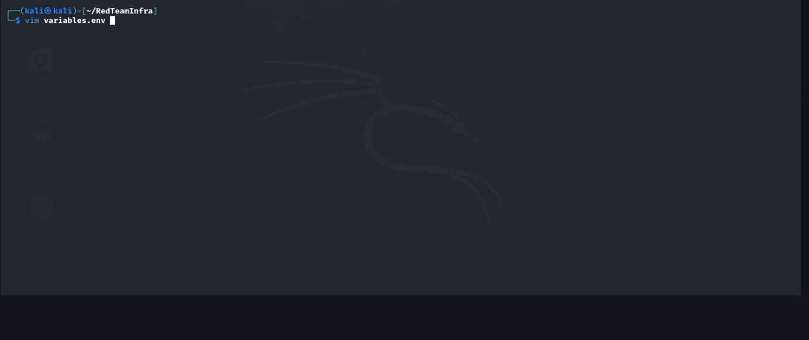

# Red Team Infrastructure Deployment

Automate the deployment of a Red Team infrastructure with Terraform and Ansible. This project sets up a Havoc C2 server, an Apache-based C2 redirector, Evilginx2 phishing server, and Gophish email phishing framework on DigitalOcean droplets.

## Features
- **Havoc C2**: Command and control server in a tmux session.
- **C2 Redirector**: Apache with SSL (Certbot) and mod_rewrite (routes 'ThisIsNotC2' User-Agent traffic to internal C2, others to Google).
- **Evilginx2**: Phishing server with dynamic domain and IP configuration.
- **Gophish**: Email phishing framework.

## Prerequisites
- **DigitalOcean Account**: API token required.
- **SSH Key**: Created using DigitalOcean, stored in `keys/`.
- **Domains**: Two domains (C2 redirector, Evilginx) with DNS control.

## Demo
Below is a demonstration of the infrastructure deployment in action:

